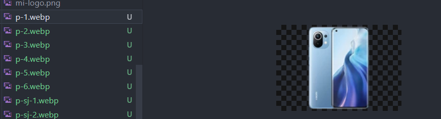

# 👀开始写代码之前请仔细阅读

### 👨‍💻 文件建立要求

`JavaScript`文件统一放在 js 文件夹下  
`CSS`文件统一放在 css 文件夹下  
`图片/音频/视频` 统一放在 resource 文件夹下

### ⚠️ 代码规范 ⚠️

#### 💻请各位下载vs code中的```JS-CSS-HTML Formatter```这个插件，每次写完代码后，右键```Format Document With...```在弹出的窗口选择```JS-CSS-HTML Formatter```这样子使得代码风格统一。
#### 命名规范
##### html命名
 ```html```命名全部以小写，以下同理。如果有必要，以```_```来连接，例如```shopping_cart.html```
##### 商品图片命名
###### 普通手机图片
p-1.webp

p表示为手机
###### 普通电脑命名
c-1.webp
第一个为品牌，第二个表示类型，c表示电脑，手机则不用写，第三个值为编号。
###### 轮播图
bar-1.jpg
第一个单词为手机品牌，第二个单词为用途，bar表示用于轮播图，第三个为编号。
#### 资源管理
1. 所有小米的手机和电脑图片放置在```resouce/mi_images```中
2. 所有苹果的手机和电脑图片放置在```resouce/apple_images```中
3. 所有视频文件放置在```resouce/video```中
4. 所有的logo文件放置在```resouce/logo```文件夹中
5. 其它则不做要求


##### css命名
`css`统一以**外部样式**的方式，无论内容多少，同时文件命名应当以`你负责的html文件_style.css`，比如你负责的是`login.html`，那么你相对应的`css`的文件应当命名为`login_style.css`
##### js命名
`JavaScript`也同理，也是以**外部链接**的方式,一个`html`文件最好只有一个`js`文件，命名应当和对应的`html`同名。
##### js代码命名
变量命名以**英文**```驼峰命名```的方式来命名🦥


#### 导入文件规范
##### css
所有```html```文件都需要导入```common_style.css```文件，用于维持导航栏样式。
##### js
所有```html```文件都需要导入```common.js```文件，用于维持全局变量。


