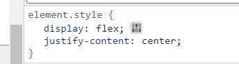

#### 浮动

尽量不要用浮动，因为浮动要**解决高度坍塌**，而且元素会移动
#### 滚动条问题

#### 同一行摆放技巧
display:flex

#### 总结
##### 解决滚动条问题
###### 第一步

去掉该元素所有的定位样式和浮动样式

去掉相邻的另一个图片的所有定位样式和浮动样式

###### 第二步
找到它们的父元素

添加样式

###### 第三步
给图片设置宽高

###### 滚动条消失

#### 莫名填充问题

#### 通过盒模型查找填充内容

#### details.html

