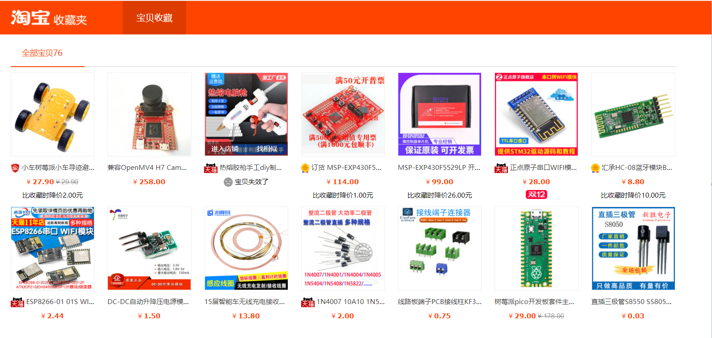
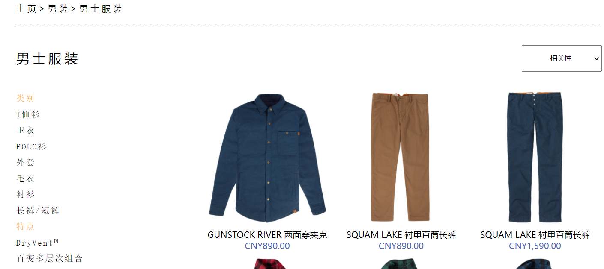
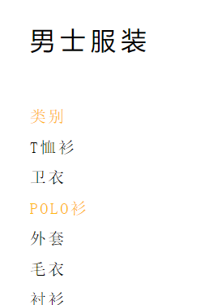
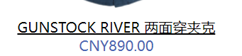
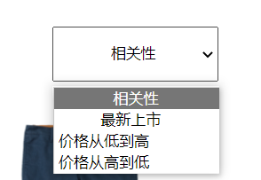

##### 页面映射表
|      页面名       |             网址             |    映射    | 负责人 |
| :---------------: | :--------------------------: | :--------: | :----: |
|     关于我们      |          about.html          |  关于我们  |   丘   |
|   具体服装页面    |   nanshifuzhuang-yifu.html   | 商品详情页 |   丘   |
|     男装/女装     | nanzhuang.html/nvzhuang.html | 手机/电脑  |   丘   |
|     喜爱清单      |       xiaiqingdan.html       |   收藏夹   |   魏   |
|     登录/注册     |    login.html/zhuce.html     | 登录/注册  |   林   |
| 男士服装/女士服装 |     nanshifuzhuang.html      | 小米/惠普  |   江   |
|      购物车       |        gouwuche.html         |   购物车   |   张   |
|       首页        |       Timberland.html        |    首页    |   张   |
##### 主题颜色

##### 页面解析
###### 商品详情页
* 伪类

* js事件

###### 收藏夹
* 伪元素

* js事件(mouseover/mouseout事件)
* 绝对定位布局

###### 登录注册

###### 小米/惠普
* 左右浮动布局
  
* 伪类
    
    
    
* js
  
###### css
common.css 用于编写多个页面通用的主题，例如头部导航。